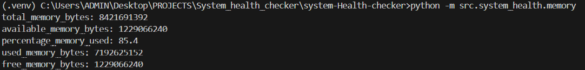

# system-Health-checker
A script that automates the  health checking of cpu and Ram and disk
Project title:
SYSTEM HEALTH CHECKER

# Description:
Sometimes the computers gets slow and even unresponsive, and unfortunately the problem to that may not be known.
This script automates the manual checking of the cpu and ram usages>
so that someone without the expertise to naviaget the computer canrun the script and get reccommendations on how the computer is and what is making it slower if possible.
It outputs the current uage of the cpu nd ram so that one can know if the computer is experiencing some bottle necks.
If the cpu and ramusage exceed a certain threshold, then  it could lead to the unresponsiveness of the computer.
This script enables one to identify with ease and so take the necessary actions which may include closing some applications, adding some ram if possible etc

# Tech stack
Python

# Prerequisite:
Python 3.14

# Repository structure
system-health-checker/
│
├── app.py
├── requirements.txt
├── README.md
│
├── src/
│   ├── __init__.py
│   ├── system_health/
│   │   ├── __init__.py
│   │   ├── cpu.py
│   │   ├── memory.py
│   │   ├── disk.py
│   │   └── checker.py
│
├── tests/
│   ├── __init__.py
│   └── test_checker.py
│
├── logs/
│   └── app.log
│
└── .gitignore
   

METRICS USED

The most important metrics to capture and their meanings are:
# 1. CPU Utilization (psutil.cpu_percent) 
What it is: A percentage showing how much of the CPU's total capacity is being used.
What it means:
0%: The CPU is doing nothing (idle).
100%: The CPU is completely maxed out.
Important Tip: Always use an interval (e.g., psutil.cpu_percent(interval=1)). If you don't, the first call will often return 0.0, which is meaningless because it hasn't had time to measure a change. 
# 2. CPU Times (psutil.cpu_times) 
This breaks down the "work" into specific categories so you know why the CPU is busy: 
User: Time spent running your actual programs (e.g., Python scripts, browser).
System: Time the CPU spent doing "office work" for the computer (e.g., managing files, talking to hardware).
I/O Wait (Linux): Time the CPU spent sitting around waiting for a slow disk or network to finish a task. If this is high, your disk is the bottleneck, not the CPU.
Idle: Time the CPU spent doing absolutely nothing. 
# 3. CPU Statistics (psutil.cpu_stats)
These measure how "noisy" or "stressed" the system is: 
Context Switches: How many times the CPU had to stop one task to start another. A very high number (thousands per second) can mean your system is "jittery" because too many programs are fighting for attention.
Interrupts: How many times hardware (like a keyboard or mouse) asked the CPU for an immediate response. 
# 4. Hardware Details
CPU Count (psutil.cpu_count): Tells you how many cores your machine has. Monitoring "Per CPU" (using percpu=True in other functions) helps you see if one core is doing all the work while others sit idle.
CPU Frequency (psutil.cpu_freq): Tells you the current speed in MHz. If this is very low, your computer might be "throttling" (slowing down) to save power or stay cool. 

# example snippet for the memory(RAM)

### what i have learnt

cpu_usage = psutil.cpu_times()
Then printing 
say print(cpu_usage)
it gives:
scputimes(
    user=43011.17187499999,
    system=30398.28125,
    idle=192504.4375,
    interrupt=1549.609375,
    dpc=9288.515625
)

so scputimes is the class
it means there must be a helper function whose job was to initialsie the class ie
def helper():
   return scputimes(user=,dpc=,,,)

then somewhere we have the class defined
class scputimes:
   def __init__(self,user,dpc,):
      return  a result

so my  thinnking and trick is this:if i see in a module that a fucntion returns something like this
 psutil.virtual_memory()
svmem(total=10367352832, available=6472179712, percent=37.6, used=8186245120, free=2181107712, active=4748992512, inactive=2758115328, buffers=790724608, cached=3500347392, shared=787554304)

tso this is an instantiated class and an instantiated class is an object  , and an object can retrieve all its attributes using the dot notation.

 # Why Python prints it like thatso if this instantiation of a class is what is output as a result

This is just:

A string representation

Meant for humans

Showing: “this object is an instance of scputimes and these are its fields”

if an aobject is a named tuple ,If an object is a named tuple, you can convert all its fields into a dictionary using _asdict()

# 2: what I have learnt
This merges one dictionary into another.

📌 dict.update():

takes key–value pairs

adds them to the dictionary

overwrites keys if they already exist

Example:
system_health = {}

cpu_usage = {
    "cpu_user": 43.0,
    "cpu_system": 21.5,
    "cpu_idle": 35.5
}

system_health.update(cpu_usage)

Result:

system_health == {
    "cpu_user": 43.0,
    "cpu_system": 21.5,
    "cpu_idle": 35.5
}